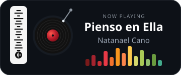

 

 

 

  

 

<pre style="background:#0d1117; color:#e6edf3; padding:20px 24px; border-radius:16px; border:1px solid #30363d; display:block; font-family:'Fira Code', monospace; font-size:16px; line-height:1.6; box-shadow: 0 8px 32px rgba(0,0,0,0.45);">
<code>{
  "name": "vcruz",
  "role": "Full-Stack Developer",
  "education": "Computer Systems Engineering",
  "focus": ["full-stack development", "automation", "DevOps"],
  "currentlyExploring": ["Go", "Python", "Docker", "Odoo"]
}</code>
</pre>

  

  

 

 

  

  

 

  

 

  

 

  
  

 

  

 

  

  
  
  

  

  

 

  
  
   
  me, debugging at 2am (probably with music on)

  

  

 

  

<i>"Code. Learn. Iterate. Repeat."</i>

 

